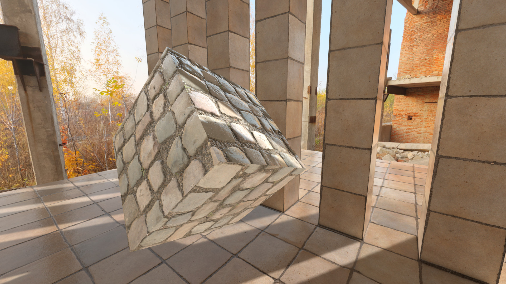
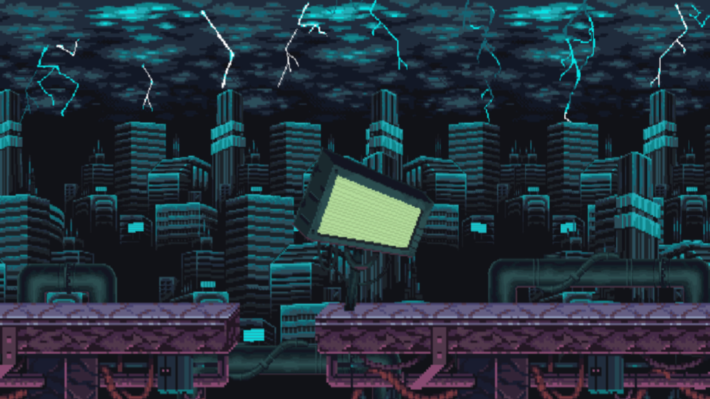

# Godot Super Scaling : Add-On For Godot Engine

Godot Super Scaling, a comprehensive post-processing effect for 3D and 2D Godot Engine games that allows you to upscale or downscale the viewport for increased performance or higher quality visuals. Supports up to 200% native resolution or down to 10%.

## INSTALLATION

[Click Here to Download the Latest Release](https://github.com/cybereality/godot-super-scaling/releases/latest)

For manual install, download the `SuperScaling` folder from this repository and copy it into your Godot project.

## CONFIGURATION

* Add the `SuperScaling.tscn` scene to your main scene tree, it should be just below the root node.
* Place your entire game world as a child of a new node under the root node (e.g. Spatial for 3D games or Node2D for 2D games).
* In the `SuperScaling` inspector settings, link the `Game World` property to the node you created above.
* Select `Enable on Play`, this will start the scaling add-on when you play the game (cannot be viewed in editor).
* Set `Usage` to either `3D` or `2D` depending on your game type.
* `MSAA` and `FXAA` are controlled by the `SuperScaling` add-on and the project settings do not take effect.
* The `SuperScaling` add-on does add some anti-aliasing, however you may want to also enable `MSAA` or `FXAA` or both.
* `Shadow Atlas` controls the map size for omni and spot lights. If you only use a directional light you can set this to `1`.
* To control the scale of the render, use the `Scale Factor` setting on the top of the inspector for `SuperScaling`.
* `1.0` for the `Scale Factor` corresponds to 100% of the native resolution. `0.5` will be 50% and `2.0` will be 200%.
* Note that setting the `Scale Factor` above `1.0` results in higher quality but will have lesser performance.
* Setting the `Scale Factor` lower than `1.0` results in an image quality loss, but higher performance.
* Please experiment with your game and your desired minimum spec to find an appropriate setting.
* Also consider exposing the scale to users, so that they may tailor the experience to their level of hardware.
* `Smoothness` controls the mix between the two scaling algorithms. `0.0` is more sharp and `1.0` is softer.
* In general, values lower than `0.5` are better for upscaling and values above `0.5` better for downscaling.
* However, this is an artistic choice and you should experiment to find the best value for your game.
* In the project settings, for 3D games, the `Stretch Mode` should be set to `disabled` and `Stretch Aspect` to `ignore`.
* For 2D games, the best project settings are `2d` for `Stretch Mode` and `keep_height` for `Stretch Aspect`.
* 2D HUD and UI elements will be shown above the scaled game and displayed at native resolution.
* For 3D games, simply create a 2D node (such as Control) as a child of the root node and it will display properly.
* For 2D games, you will need to create a Node2D and place your UI elements inside that. Then set the `Z Index` to `1` or above.
* Be sure that `Use VSync` is set to `On` in the project settings for the smoothest performance.
* One thing to note, `SuperScaling` will take control of your game while enabled, and you will no longer be able to edit as you play.
* It is recommended to leave `Enable on Play` off while developing, and only enable the add-on when you need to test the graphics or performance.

## LICENSE

MIT License

Copyright (c) 2021 Andres Hernandez

Permission is hereby granted, free of charge, to any person obtaining a copy
of this software and associated documentation files (the "Software"), to deal
in the Software without restriction, including without limitation the rights
to use, copy, modify, merge, publish, distribute, sublicense, and/or sell
copies of the Software, and to permit persons to whom the Software is
furnished to do so, subject to the following conditions:

The above copyright notice and this permission notice shall be included in all
copies or substantial portions of the Software.

THE SOFTWARE IS PROVIDED "AS IS", WITHOUT WARRANTY OF ANY KIND, EXPRESS OR
IMPLIED, INCLUDING BUT NOT LIMITED TO THE WARRANTIES OF MERCHANTABILITY,
FITNESS FOR A PARTICULAR PURPOSE AND NONINFRINGEMENT. IN NO EVENT SHALL THE
AUTHORS OR COPYRIGHT HOLDERS BE LIABLE FOR ANY CLAIM, DAMAGES OR OTHER
LIABILITY, WHETHER IN AN ACTION OF CONTRACT, TORT OR OTHERWISE, ARISING FROM,
OUT OF OR IN CONNECTION WITH THE SOFTWARE OR THE USE OR OTHER DEALINGS IN THE
SOFTWARE.
